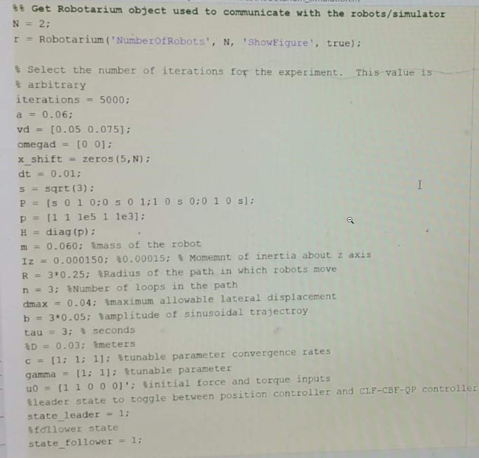

# EECS 206b Final Project Website

## Project Overview
In this project we try to accomplish two goals. First, we survey texts relating to Control Lypanouv Functions and Control Barrier Functions in order to summarize this newly developed field. Second, we try to implement a CLF-CBF-QP Controller onto the Robatarium testbed using Control Barrier Functions for adaptive speed regulation and lane keeping. 

## Implementation
The implementation of the CLF-CBF-QP controller was done in MATLAB.

## Videos of Results
Here we have a video of the CLF-CBF-QP being run on the actual Robatarium testbed.

This confirms 

## Team
#### Gyanendra Tripathi 
Gyanendra is a graduate student of Public Policy (GSPP) with over 2 decades of experience in implementation and formulation of public policies in India. He has successfully completed EE 206A in last fall and in this semester besides pursuing EE 206B he is also learning 'Introduction to Machine Learning CS-289A'. He did BE in Electrical Engineering from IIT Roorkee(1996) and MTech in Power Electronics from IIT Kanpur(1998) before undertaking his career in civil service of India.
